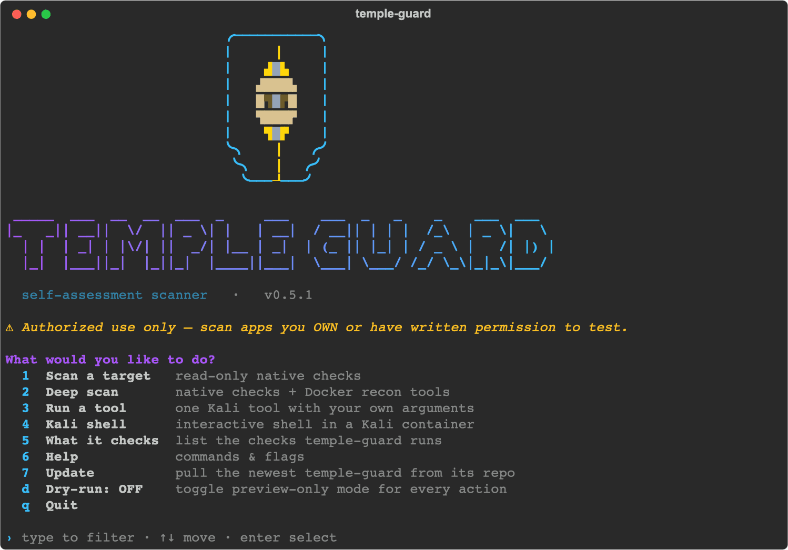
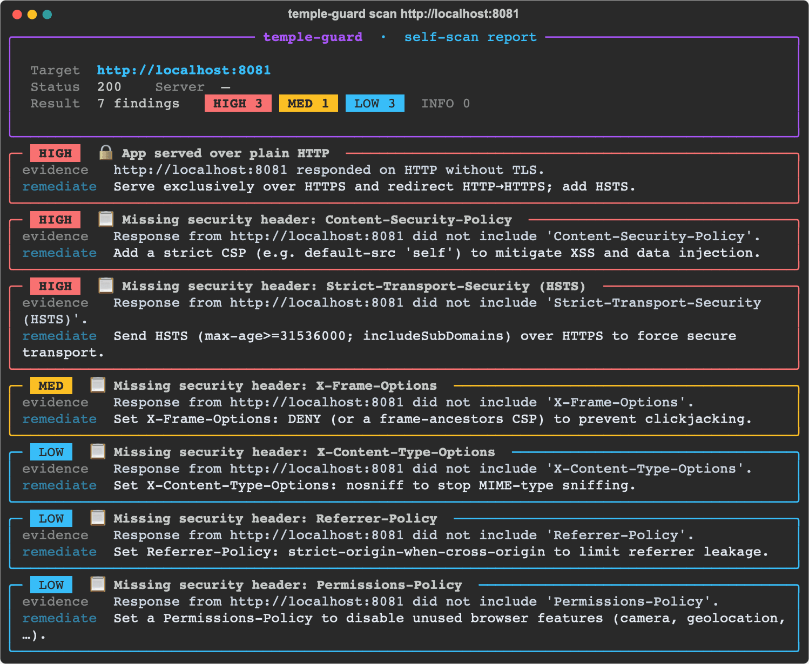
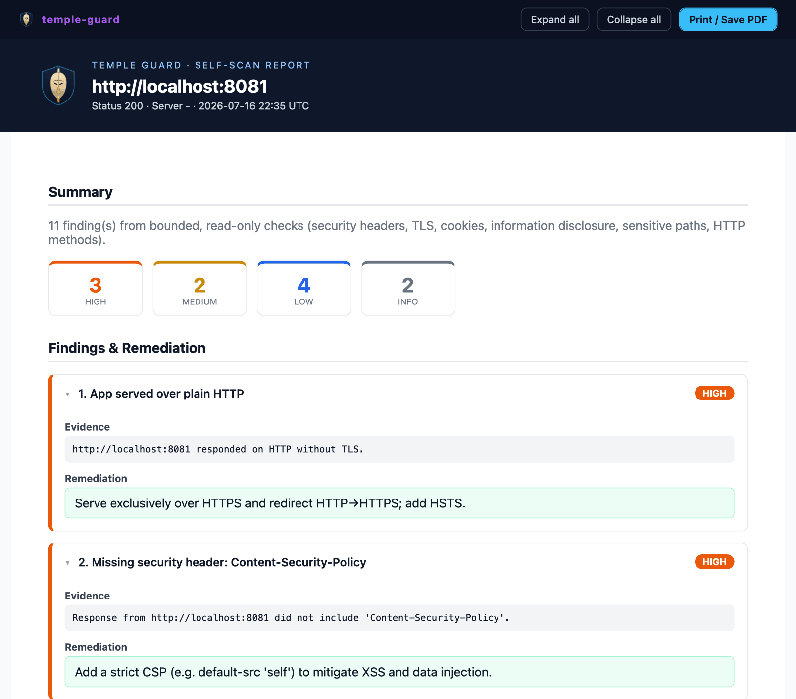
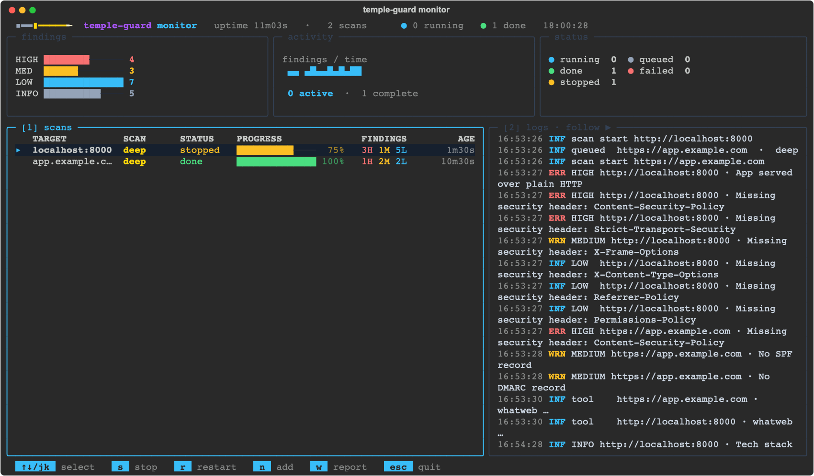
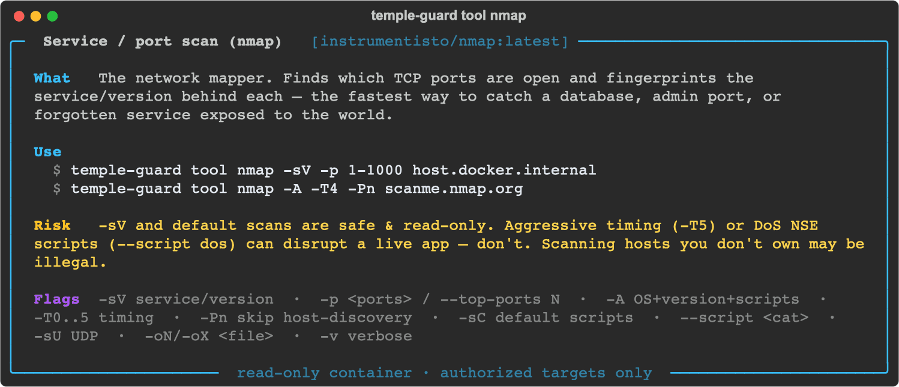
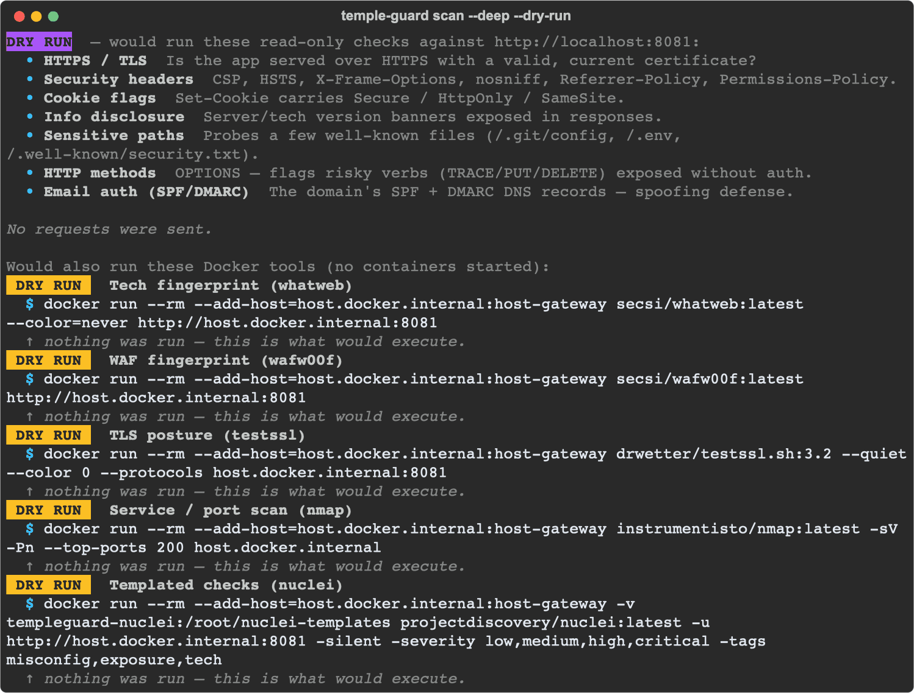

# temple-guard (CLI)

Scan a web app **you own** and get a remediation report — right in your terminal.
Bounded, read-only native checks (security headers, TLS/certificate, cookie flags, info
disclosure, exposed sensitive files, risky HTTP methods, SPF/DMARC email posture) — none
of which exploit, flood, or brute-force. Optionally, with **Docker**, it also runs real
defensive tools (`testssl`, `nmap`, `nuclei`, `nikto`, `wafw00f`, `whatweb`) and merges
their findings into the same report.

## Commands

| Command | What it does |
|---|---|
| `temple-guard` | Interactive, fuzzy type-to-filter menu — every option in one place. |
| `scan <url>` | Bounded, read-only self-scan → report (`--deep`, `--tools`, `-o`, `--json`, `-v`, `--dry-run`). `scan --pick` chooses a target from your authorized scope. |
| `monitor <urls…>` | Run several scans at once in a live, btop-style dashboard. |
| `tool <name> [args]` | Run one Docker tool with its full flag set — or an explainer with no args. |
| `shell` | Drop into an interactive Kali container. |
| `doctor [--pull]` | Check Docker readiness; `--pull` pre-fetches every tool image. |
| `osint <domain · name · email · phone>` | Passive, read-only OSINT / HUMINT footprint of a domain, name, email, or phone. |
| `apitest <url>` | Discover an API's endpoints, then run bounded, read-only posture checks. |
| `strix import <path>` | Ingest a [Strix](https://github.com/usestrix/strix) vulnerability report (a `strix_runs/` directory) → prioritized remediation in the Temple Guard report. Live autonomous validation is a private-build / hosted feature. |
| `client` · `scope` | Register clients → engagements → authorized scope (stored under `~/.temple-guard/clients`); scoped targets are pickable in `scan` / `playbook` / `pentest`. |
| `playbook list` · `playbook run <id> <url>` | Ordered recon → web → TLS recipes. |
| `pentest` | Pick any combination of bounded tests across one or more targets → one combined report. |
| `update [--check]` | Self-update from the git repo. |
| `version` | Print the installed version. |

**Every** command takes `--dry-run` — it prints exactly what *would* happen and sends nothing.

## What it looks like

A fuzzy, type-to-filter menu — start typing to narrow it down:



A scan of your app: findings ranked by severity, each with evidence + remediation.



`--deep` merges the Docker recon tools into the same report — here `nmap` catches a database
exposed on the host, and `wafw00f` flags that nothing sits in front of the app:


## Install

`temple-guard` is a self-contained Python CLI (Python 3.9+). The cleanest install is
with **[pipx](https://pipx.pypa.io/)** — it puts the tool in its own isolated
environment and on your PATH. Grab `temple_guard-<version>-py3-none-any.whl` from the
repo's **Releases**, then follow your platform:

### macOS
```bash
brew install pipx            # if you don't already have pipx
pipx ensurepath              # once — then open a new terminal

pipx install ./temple_guard-0.5.4-py3-none-any.whl
```

### Windows (PowerShell)
```powershell
py -m pip install --user pipx    # if you don't already have pipx
py -m pipx ensurepath            # once — then open a new terminal

pipx install .\temple_guard-0.5.4-py3-none-any.whl
```

### Linux / other
```bash
python3 -m pip install --user pipx && python3 -m pipx ensurepath
pipx install ./temple_guard-0.5.4-py3-none-any.whl
```

Once it's published to PyPI you'll be able to skip the wheel and just
`pipx install temple-guard`. Prefer not to use pipx? `pip install
./temple_guard-0.5.4-py3-none-any.whl` works too (ideally inside a virtualenv).

**Manage it:** `pipx uninstall temple-guard` · to **update**, see below.

## Updating

`temple-guard` isn't on PyPI, so `pipx upgrade` has nothing to fetch — the CLI updates
**itself from the git repo**:
```bash
temple-guard update            # pull the newest source and reinstall
temple-guard update --check    # just report whether a newer version exists
```
If you're running it from a local checkout it `git pull`s and reinstalls that; otherwise it
clones the public repo to `~/.local/share/temple-guard/repo`. (You can always reinstall a
wheel by hand instead: `pipx install --force ./temple_guard-<version>-py3-none-any.whl`.)

### `temple-guard: command not found`?
pipx installs the command into a user bin directory that must be on your **PATH**:
`~/.local/bin` (macOS / Linux) or `%USERPROFILE%\.local\bin` / the Python user `Scripts`
dir (Windows). `pipx ensurepath` (above) adds it — but you must then **open a new
terminal** (or `source ~/.zshrc` / `~/.bashrc`) for the change to take effect. Verify with
`pipx list` and `temple-guard version`.
> On zsh with `AUTO_CD` (e.g. oh-my-zsh), if PATH still isn't set, typing bare
> `temple-guard` may just `cd` into a same-named folder — that's the PATH, not the tool.

## Usage

**Interactive** — a colourful session with a **fuzzy, type-to-filter menu** (fzy/fzf-style:
start typing to narrow the options, ↑↓ to move, enter to pick; **Esc = back, Ctrl+C = quit**).
It walks you through the target and options (verbose, save format), and a **Dry-run toggle**
makes *every* action preview-only:
```bash
temple-guard                 # bare command launches it — or: temple-guard interactive
```
> Prefer the classic numbered menu (no fuzzy)? Set `TG_NO_FUZZY=1`.

**Direct** — scan straight away:
```bash
temple-guard scan https://your-app.example.com                # colourful report
temple-guard scan --pick                                      # pick a target from your authorized scope
temple-guard scan https://your-app.example.com -v             # verbose: show each check + finding live
temple-guard scan https://your-app.example.com --dry-run      # list the checks, send nothing
temple-guard scan https://your-app.example.com -o report.html # collapsible HTML report (see formats below)
temple-guard scan https://your-app.example.com --json         # machine-readable findings
temple-guard version
```

`-o / --report` picks the format from the file **extension**:

| Extension | Output |
|---|---|
| `.html` | A **collapsible** report styled like the platform's — Expand/Collapse-all, and **Print → PDF** for a polished PDF |
| `.pdf`  | A clean, branded PDF (self-contained — no browser needed) |
| `.md`   | Markdown (table + evidence) |
| `.json` | Machine-readable findings |

The `.html` report is a self-contained, collapsible page styled like the platform's —
expand/collapse findings, and **Print / Save PDF** for a polished PDF:



`-v / --verbose` streams each check and every finding as it happens. The scan exits
non-zero when a **HIGH** finding is present, so it slots straight into CI.

## Monitor — run several scans at once

`temple-guard` can run **multiple scans concurrently** and watch them in a live,
btop-style dashboard:



*Two deep scans in the live monitor. Top row: findings-severity meters (HIGH/MED/LOW/INFO), an
activity sparkline, and a status panel. Middle: the per-scan table — target, **SCAN** profile
(`deep`), status, an animated progress bar, findings, and age — here one scan is **stopped**
mid-run (75%) and one is **done** (100%). Right: a live, scrolling **log stream** (security-header,
SPF/DMARC, and Docker-tool findings as they land). Keys along the bottom: select · stop · restart
· add · report · quit.*

```bash
temple-guard monitor https://a.example.com https://b.example.com   # scan both at once
temple-guard monitor https://a.example.com -w 8                    # up to 8 concurrent
```
Or pick **Monitor** from the interactive menu. The dashboard shows animated progress bars, a
findings-severity meter, an activity sparkline, per-scan status, and a live log stream.

| Key | Action |
|---|---|
| `↑` `↓` / `j` `k` | select a scan |
| `s` | stop the selected scan |
| `r` | restart the selected scan |
| `n` | add target(s), then **pick what runs**: native · deep · specific tools |
| `w` | write **one combined report** for all scans (`.html` / `.md` / `.json`) |
| `Esc` / `Ctrl+C` | leave the dashboard — **asks to confirm** (and warns if scans are still running) |

Launching **Monitor** from the menu opens the dashboard **empty** — add targets with `n`. When
you add a target you choose **what runs against it**: **Native checks** (fast, no Docker),
**Deep** (native + the Docker recon set — whatweb, wafw00f, testssl, nmap, nuclei), or **Pick
tools…** (native + specific tools). Tool findings merge into the same live counters and the
combined report, and each row's **SCAN** column shows the chosen profile.

Every row is a real scan in its own thread (no mock data). For a scripted run, preload targets
and a profile and let `-o` write the combined report on exit:
```bash
temple-guard monitor https://a.example.com https://b.example.com -o report.html   # native
temple-guard monitor https://a.example.com --deep -o report.html                  # + Docker recon
temple-guard monitor https://a.example.com --tools nmap,nuclei                     # specific tools
```
Without an interactive terminal (a pipe / CI) it runs headless and prints a summary.

## Deep scan — Docker tools (optional)

> **Prerequisites.** The deep-scan tools each run in **Docker** — install
> **[Docker Desktop](https://docs.docker.com/get-docker/)** (macOS / Windows) or the Docker
> Engine (Linux) and make sure it's running. Then run **`temple-guard doctor`** to check
> readiness, or **`temple-guard doctor --pull`** to fetch every tool image up front (otherwise
> the first run of each tool pulls its image on demand — a one-time download of a few hundred MB
> total, cached afterwards). **No Docker? The native checks still run** — the tools are skipped
> with a clear note telling you what to do. There's nothing else to install: the images are
> public and pulled automatically; no Kali image to build.

With **Docker** running, add real tool containers to any scan; their findings merge into
the same unified report:
```bash
temple-guard scan https://your-app.example.com --deep              # whatweb + wafw00f + testssl + nmap + nuclei
temple-guard scan https://your-app.example.com --tools nmap,nikto  # only the ones you name
```

| Tool | Image | What it adds |
|---|---|---|
| `whatweb` | `secsi/whatweb` | tech-stack fingerprint — server, framework, CMS, JS libs **+ versions** |
| `wafw00f` | `secsi/wafw00f` | whether a WAF/CDN fronts the app, and which one |
| `testssl` | `drwetter/testssl.sh` | deep TLS / crypto posture (protocols, ciphers, cert) |
| `nmap` | `instrumentisto/nmap` | open ports / exposed services **on the host** |
| `nuclei` | `projectdiscovery/nuclei` | misconfiguration + exposure templates (first run downloads templates) |
| `nikto` | `frapsoft/nikto` | web-server misconfig, dangerous files, admin paths, outdated software |

`--deep` runs the quick recon set (`whatweb, wafw00f, testssl, nmap, nuclei`); **`nikto` is
opt-in** via `--tools nikto` because it's slow and noisy. A `localhost` target is reached
from the container via the host's numeric IPv4 (auto-remapped). Heads-up: **`nmap` scans the
host's ports** (not just the one app), so it surfaces things like an exposed database. If
Docker isn't available the tools are skipped and the native checks still run.

### Run a tool with your own flags
`--deep` uses each tool's default command. To drive a tool with **its full argument set**,
use `temple-guard tool` — everything after the tool name is passed straight through:
```bash
temple-guard tool                       # list the tools
temple-guard tool nmap                  # explainer: what it is · how to use it · risks · flags
temple-guard tool nmap -sV -p 1-1000 host.docker.internal
temple-guard tool nmap -h               # nmap's own help / all options
temple-guard tool nikto -h http://host.docker.internal:8081
temple-guard tool wafw00f https://example.com
temple-guard tool whatweb https://example.com
temple-guard tool nuclei -u https://example.com -tags cve,exposure
```
Run `temple-guard tool <name>` with **no arguments** for a full explainer (what it is, how
to use it, its risks, and the key flags). `localhost` / `127.0.0.1` / `host.docker.internal`
is auto-remapped to the host's numeric IPv4 so the container reliably reaches your app. It
prints the tool's raw output. (Also available as "Run a tool" in the interactive menu.)

Every tool comes with an explainer — what it is, how to use it, its risks, and the key flags:



## OSINT footprint — `osint`

Map an org's **public** footprint the way an attacker would — passively and read-only, from
open sources. Point it at a **domain, a name, an email, or a phone number**:
```bash
temple-guard osint example.com              # domain — subdomains, records, exposed surface
temple-guard osint "Jane Doe"               # name — public profiles / mentions
temple-guard osint jane@example.com         # email — exposure / breach surface
temple-guard osint +15551234567             # phone — country, line type, public footprint
temple-guard osint example.com --dry-run    # show what it would look up, fetch nothing
```
It only consults open sources — nothing intrusive. Use it to assess an exposure you're
**authorized** to assess.

## API testing — `apitest`

Discover an API's endpoints (an OpenAPI/Swagger spec, or common-path probing), then run
**bounded, read-only** posture checks against them:
```bash
temple-guard apitest https://api.example.com             # discover + bounded posture checks
temple-guard apitest https://api.example.com --dry-run   # list what it would probe
```
Request bursts are hard-capped — never a flood. It flags unauthenticated access, missing
rate limiting, verbose errors, and slow endpoints (OWASP API Security Top 10).

## Playbooks — `playbook`

Ordered recipes that chain the bounded checks in sequence — **recon → web → TLS** — and fold
every finding into one report:
```bash
temple-guard playbook list                                    # the available recipes + their ids
temple-guard playbook run <id> https://your-app.example.com   # run one against your app
temple-guard playbook run <id> https://your-app.example.com --dry-run
```
Each step is one of the same read-only checks the CLI already runs — the playbook just
sequences them.

## Pentest — one combined report — `pentest`

Pick **any combination** of the bounded tests and run them across **one or more targets**,
then get a single combined report:
```bash
temple-guard pentest                                          # interactive: choose tests + targets
temple-guard pentest https://a.example.com https://b.example.com -o report.html
temple-guard pentest https://your-app.example.com --dry-run
```
Same bounded, read-only checks as everywhere else — just assembled into one pass and one
deliverable.

## Strix — vulnerability validation — `strix import`

[Strix](https://github.com/usestrix/strix) is an open-source engine that autonomously finds and
**validates** real weaknesses in an app you own — so you can fix them before an attacker finds them.
Run Strix yourself, then bring its results into Temple Guard for prioritized remediation:
```bash
temple-guard strix import ./strix_runs/<run-name>     # → findings + fixes, in the TG report
temple-guard strix import ./strix_runs/<run-name> -o report.html
```
It reads Strix's `vulnerabilities.json` (or `findings.sarif`), maps each finding to a severity +
category with remediation, and renders it like any other scan. **Live, in-app validation runs are a
private-build / hosted feature** — this open build is import-only.

## Clients & scope — `client` / `scope`

Keep your **authorized scope** in one place. Register clients, open engagements, and record
the targets you're cleared to test — stored locally under `~/.temple-guard/clients`:
```bash
temple-guard client                 # register / manage clients + engagements
temple-guard scope                  # view / edit an engagement's authorized scope
temple-guard scan --pick            # pick a scoped target instead of typing a URL
```
Scoped targets become **pickable** in `scan`, `playbook`, and `pentest` — so you don't
fat-finger a host you aren't cleared for.

## Dry run — preview any action

**Every** action has a dry run: it prints exactly what *would* happen and runs nothing.
```bash
temple-guard scan <url> --dry-run          # list the native checks (sends nothing)
temple-guard scan <url> --deep --dry-run   # + the exact docker command for each tool
temple-guard tool nmap --dry-run <args>    # the docker command a tool run would execute
temple-guard shell --dry-run               # the shell container command
```
In the interactive menu, flip **Dry-run: ON** and every choice becomes preview-only.



## Interactive Kali shell
```bash
temple-guard shell             # drop into a Kali container (first run pulls ~1 GB); 'exit' to leave
temple-guard shell --dry-run   # just print the container command; start nothing
```

> ⚠️ **Authorized use only** — run this against applications you own or have explicit
> written permission to test.
